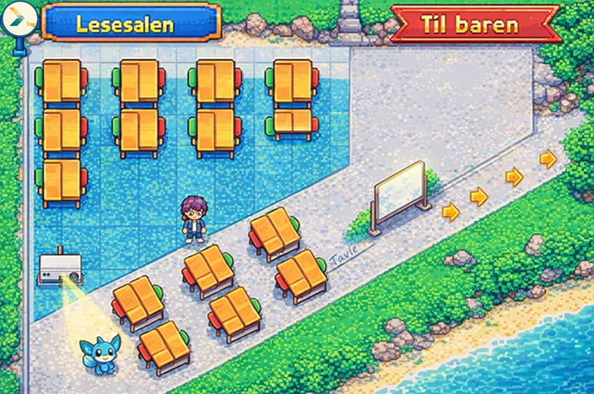

# Webathon 2026

# \StudyStarPlanet

\StudyStarPlanet AS

## Medlemmer

- \Tord
- \Olav
- \Erik
- \Siren

## Beskrivelse

\ Loosely inspirert av MovieStarPlanet og Pokémon. Istedenfor å lure på "Er det kaffe igjen på lesesalen nå?" hver fredag så kan du sjekke status med å gå bort til kaffemaskinen på den virtuelle lesesalen og sjekke status. Last opp når du tar oppvask, lager kaffe, når du er til stede på sal osv. Dine handlinger blir belønnet med tokens som du kan bruke i minispillene på StudyStarPlanet aka. din virtuelle lesesal! Sammenlign din progress med de andre, la alle se at du er tidenes SALTRØKKER.

## Kjøre

\<guide på hvordan man kjører/bygger prosjektet>

## Bilder

\<screenshots av prosjektet (blir også postet på webathon siden på echo.uib.no)>

